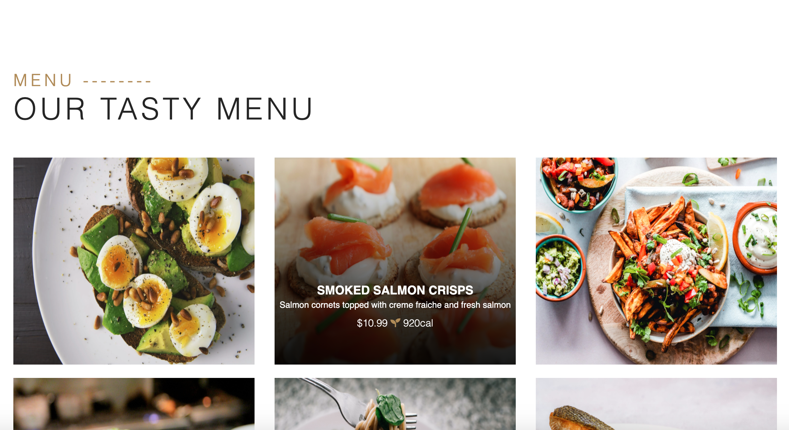
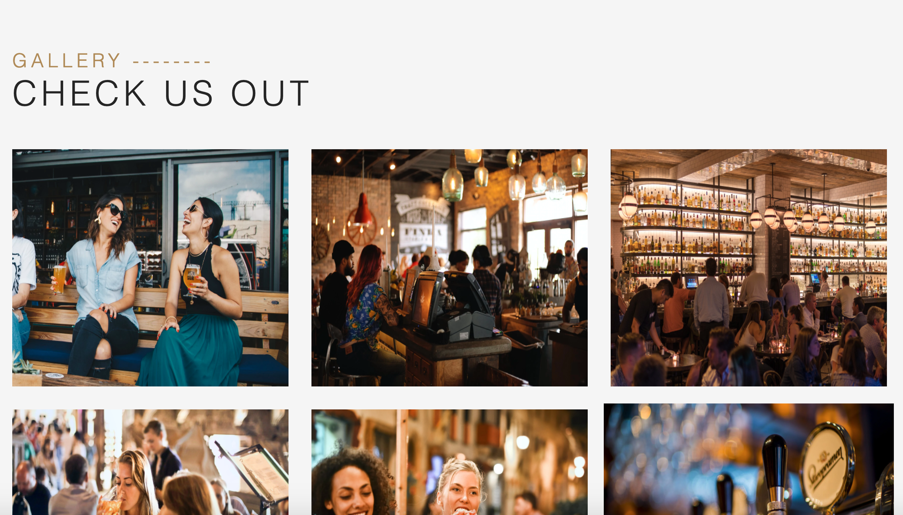
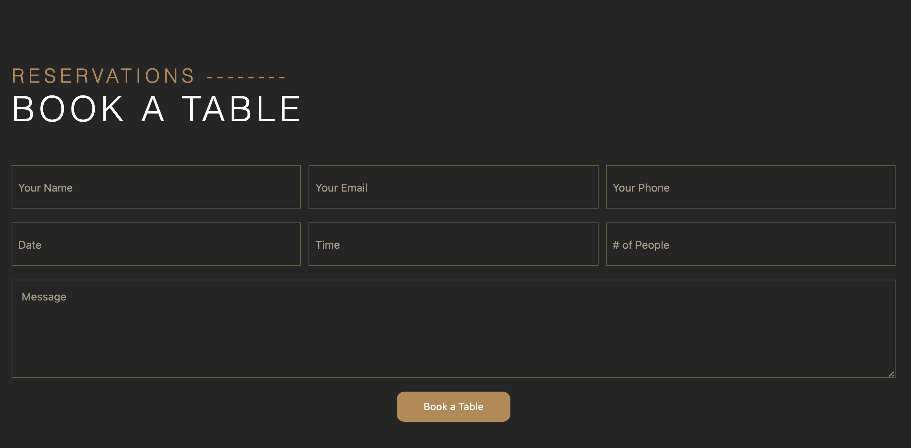

# Project_2

## Table of Contents
* [Description](#description)
* [User Story](#userstory)
* [Installation](#installation)
* [Usage](#usage)
* [License](#license)
* [Visuals](#visuals)
* [Deployment](#deployment)
* [Contributing](#contributing)
* [Support](#support)

## Description
Lockhart Lounge is an all-in-one restaurant application that provides users with a way to book reservations, view menu items and order online with ease.

## User Story
As a restaurant aficionado
- I WANT to be able to book a table, order online, view menu items and read through other relevant information on my favorite restaurant’s website
- SO THAT I can be well-informed and indulge in all the functionalities that a modern restaurant application has to offer.

## Installation
This application requires the following node packages:
* Express
* Express-Handlebars
* MySQL

To install, run "npm install" in your Command Line System.

## Usage
To use this application, you must first create your MySQL database by running both the schema.sql and seeds.sql files in your Command Line System. Then, enter "node server.js" & navigate to the specified port in your browser to access the application.

## License

## Visuals

## Deployment
https://thedaringpenguins.herokuapp.com/

## Contributing
Pull requests are welcome. For major changes, please open an issue first to discuss what you would like to change. 

## Support
For questions, comments or concerns regarding the Lockhart Lounge application, please get in contact with any of the contributors listed below.

## Author
| Henry
------------ 

[ <b>Henry Liu</b>](https://github.com/hl748) [💻](https://github.com/hl748?tab=repositories "Repositories")

